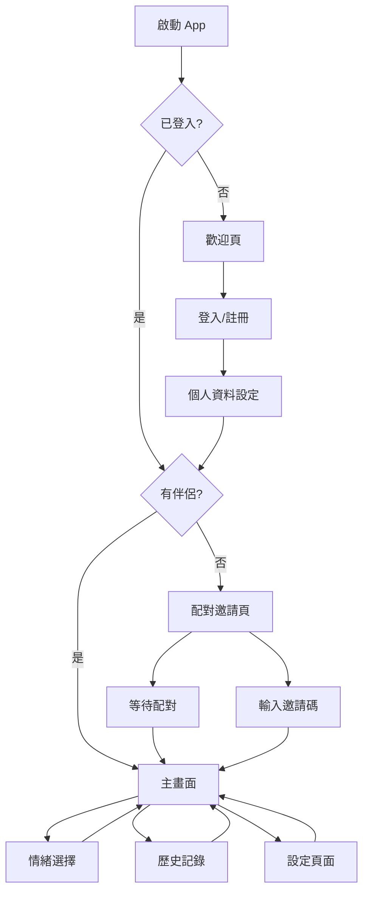

# 🔄 MoodSync App 流程設計

## 1. 用戶旅程概覽

### 1.1 整體流程圖


### 1.2 核心用戶場景

#### 場景 1：新用戶首次使用
```
1. 用戶下載並打開 App
2. 看到歡迎頁面和品牌介紹
3. 選擇註冊新帳號
4. 設定個人資料（暱稱、頭像）
5. 創建配對邀請或輸入伴侶邀請碼
6. 成功配對後進入主畫面
7. 設定第一個情緒狀態
```

#### 場景 2：日常使用流程
```
1. 打開 App 自動登入
2. 查看主畫面上伴侶的當前狀態
3. 點擊更新自己的情緒
4. 選擇 emoji 和輸入簡短文字
5. 確認發送，伴侶收到通知
6. 查看情緒歷史記錄
```

#### 場景 3：情緒溝通場景
```
1. 用戶感到不開心
2. 選擇難過的 emoji 😢
3. 添加簡短說明：「今天工作壓力很大」
4. 伴侶收到推送通知
5. 伴侶回應關心的情緒 💗
6. 雙方透過 App 互相理解
```

## 2. 畫面流程詳解

### 2.1 啟動與認證流程

#### 啟動畫面 (Launch Screen)
```
功能：
- 顯示 MoodSync Logo
- 品牌動畫效果
- 自動檢測登入狀態

時長：2-3 秒
導航：自動跳轉到對應頁面
```

#### 歡迎頁 (Welcome Screen)
```
顯示條件：用戶未登入
內容：
- App 功能介紹
- 核心價值展示
- 「開始使用」按鈕

用戶操作：
- 點擊「開始使用」→ 登入/註冊頁
- 滑動查看功能介紹
```

#### 登入/註冊頁 (Auth Screen)
```
登入模式：
- 電子郵件輸入框
- 密碼輸入框
- 「登入」按鈕
- 「忘記密碼」連結
- 「還沒有帳號？註冊」連結

註冊模式：
- 電子郵件輸入框
- 密碼輸入框
- 確認密碼輸入框
- 暱稱輸入框
- 「註冊」按鈕
- 「已有帳號？登入」連結

錯誤處理：
- 輸入驗證提示
- 網路錯誤提示
- Firebase 錯誤處理
```

### 2.2 個人資料設定流程

#### 個人資料頁 (Profile Setup)
```
顯示條件：新註冊用戶
內容：
- 頭像上傳區域
- 暱稱編輯框
- 生日選擇器（選填）
- 性別選擇（選填）

用戶操作：
- 點擊頭像區域 → 照片選擇器
- 輸入暱稱
- 「完成設定」按鈕 → 配對頁面

驗證：
- 暱稱不能為空
- 頭像可選但建議設定
```

### 2.3 配對流程

#### 配對頁面 (Pairing Screen)
```
顯示條件：用戶沒有伴侶
佈局：兩個主要選項

選項 1：創建邀請
- 「邀請伴侶」按鈕
- 生成唯一邀請碼
- QR Code 顯示
- 分享選項（簡訊、社交媒體）

選項 2：加入邀請
- 「輸入邀請碼」輸入框
- 「掃描 QR Code」按鈕
- 「加入」按鈕

狀態顯示：
- 等待配對中的動畫
- 配對成功的慶祝動畫
```

#### 邀請等待頁 (Waiting Screen)
```
顯示條件：已發送邀請等待對方接受
內容：
- 邀請碼顯示
- QR Code
- 「分享邀請」按鈕
- 等待動畫
- 「取消邀請」選項

自動更新：
- 即時監聽配對狀態
- 對方接受後自動跳轉
```

### 2.4 主要功能流程

#### 主畫面 (Main Dashboard)
```
佈局結構：
┌─────────────────────┐
│     導航欄（設定）     │
├─────────────────────┤
│    伴侶狀態卡片      │
│  ┌─────────────────┐ │
│  │ 頭像  名字      │ │
│  │ 😊 「很開心」   │ │
│  │ 「今天很棒！」   │ │
│  │ 2分鐘前        │ │
│  └─────────────────┘ │
├─────────────────────┤
│    我的狀態卡片      │
│  ┌─────────────────┐ │
│  │ 「更新我的狀態」  │ │
│  │     + 按鈕      │ │
│  └─────────────────┘ │
├─────────────────────┤
│    快速回應區域      │
│  💗 👍 🤗 😢 😴    │
└─────────────────────┘

底部標籤欄：
- 首頁（選中）
- 歷史
- 設定
```

#### 情緒選擇頁 (Mood Selection)
```
進入方式：
- 點擊主畫面「更新狀態」
- 點擊快速回應 emoji

佈局：
┌─────────────────────┐
│ ← 返回    發送狀態 ✓ │
├─────────────────────┤
│      情緒分類       │
│ 😊😍😢😠😴😎       │
├─────────────────────┤
│     Emoji 網格      │
│ 😀😃😄😁😆😅       │
│ 🥰😘😗😙😚😋       │
│ （6列×N行佈局）     │
├─────────────────────┤
│   文字輸入區域      │
│ ┌─────────────────┐ │
│ │「說點什麼...」   │ │
│ └─────────────────┘ │
├─────────────────────┤
│    強度滑條        │
│ 😶 ████████░░ 😆   │
│     (1-5級)       │
└─────────────────────┘

互動效果：
- Emoji 點擊：放大動畫 + 選中狀態
- 文字輸入：即時字數統計
- 強度滑條：觸覺回饋
```

#### 歷史記錄頁 (History Screen)
```
佈局：
┌─────────────────────┐
│    歷史記錄  📊     │
├─────────────────────┤
│   時間篩選器        │
│ [今天][本週][本月]   │
├─────────────────────┤
│    記錄列表        │
│ ┌─────────────────┐ │
│ │ 😊  2小時前     │ │
│ │ 「工作順利！」   │ │
│ │ ─── 你 ───     │ │
│ └─────────────────┘ │
│ ┌─────────────────┐ │
│ │ 💗  5小時前     │ │
│ │ 「想你了」      │ │
│ │ ─── 伴侶 ───   │ │
│ └─────────────────┘ │
├─────────────────────┤
│    統計圖表        │
│ [情緒趨勢][共同模式] │
└─────────────────────┘

功能：
- 下拉刷新
- 無限滾動
- 點擊查看詳情
- 篩選和搜索
```

### 2.5 設定與管理流程

#### 設定頁面 (Settings Screen)
```
分組列表：
┌─────────────────────┐
│      個人設定       │
│ 👤 個人資料        │
│ 🔔 通知設定        │
│ 🎨 主題外觀        │
├─────────────────────┤
│      關係設定       │
│ 💑 伴侶資訊        │
│ 🔗 配對管理        │
│ 📝 共同設定        │
├─────────────────────┤
│      其他設定       │
│ 🔒 隱私安全        │
│ ❓ 說明支援        │
│ 📊 意見回饋        │
│ 🚪 登出           │
└─────────────────────┘
```

#### 個人資料編輯 (Profile Edit)
```
內容：
- 頭像更新
- 暱稱編輯
- 電子郵件顯示（不可編輯）
- 密碼變更
- 帳號資訊

操作：
- 「儲存變更」按鈕
- 「取消」按鈕
- 資料驗證
```

#### 通知設定 (Notification Settings)
```
選項：
- 推送通知總開關
- 伴侶狀態更新通知
- 配對邀請通知
- 免打擾時間設定
- 通知音效選擇
- 振動設定

每個選項都有開關控制
時間設定使用時間選擇器
```

## 3. 狀態管理

### 3.1 App 狀態

#### 全域狀態
```swift
enum AppState {
    case launching          // 啟動中
    case unauthenticated   // 未登入
    case authenticating    // 登入中
    case onboarding        // 首次設定
    case unpaired          // 未配對
    case pairing           // 配對中
    case main              // 主要功能
}
```

#### 用戶狀態
```swift
enum UserStatus {
    case offline           // 離線
    case online            // 在線
    case away              // 離開
}
```

#### 配對狀態
```swift
enum PairingStatus {
    case none              // 無配對
    case pending           // 等待中
    case paired            // 已配對
    case disconnected      // 中斷連接
}
```

### 3.2 頁面導航

#### 導航堆疊管理
```swift
class NavigationManager: ObservableObject {
    @Published var currentScreen: Screen = .launch
    @Published var navigationStack: [Screen] = []
    
    enum Screen {
        case launch
        case welcome
        case auth
        case profileSetup
        case pairing
        case waiting
        case main
        case moodSelection
        case history
        case settings
    }
    
    func navigate(to screen: Screen) {
        navigationStack.append(currentScreen)
        currentScreen = screen
    }
    
    func goBack() {
        if let previous = navigationStack.popLast() {
            currentScreen = previous
        }
    }
}
```

## 4. 錯誤處理流程

### 4.1 網路錯誤
```
檢測：NetworkMonitor 監控連線狀態
處理：
- 顯示離線指示器
- 緩存用戶操作
- 連線恢復後同步
- 友善的錯誤提示
```

### 4.2 資料錯誤
```
情況：
- Firebase 錯誤
- 資料格式錯誤
- 同步衝突

處理：
- 錯誤訊息本地化
- 重試機制
- 降級功能
- 錯誤回報
```

### 4.3 用戶操作錯誤
```
情況：
- 輸入驗證失敗
- 操作權限不足
- 配對失敗

處理：
- 即時驗證回饋
- 清楚的錯誤說明
- 操作指引
- 替代方案建議
```

## 5. 通知流程

### 5.1 推送通知處理
```
收到通知 → 判斷 App 狀態 → 對應處理

前台：
- 顯示 Banner 通知
- 更新 UI 狀態
- 播放音效/振動

後台：
- 顯示系統通知
- 更新 Badge 數字
- 保存到本地

未啟動：
- 系統通知顯示
- 點擊啟動 App
- 直接導航到相關頁面
```

### 5.2 本地通知
```
用途：
- 提醒用戶更新狀態
- 關懷伴侶提醒
- 重要時刻提醒

時機：
- 每日固定時間
- 長時間未更新
- 伴侶需要關心時
```

## 6. 效能優化

### 6.1 頁面載入優化
```
策略：
- 延遲載入非關鍵內容
- 預載入下一頁面資源
- 圖片懶載入
- 快取常用資料
```

### 6.2 動畫效能
```
原則：
- 使用硬體加速動畫
- 避免複雜動畫疊加
- 低電量模式適配
- 60fps 流暢度目標
```

## 7. 用戶體驗優化

### 7.1 載入狀態
```
全域載入：
- 啟動畫面
- 資料同步中

局部載入：
- 發送狀態中
- 圖片上傳中
- 列表載入中

使用骨架屏和載入動畫
```

### 7.2 空白狀態
```
情況：
- 首次使用無歷史記錄
- 伴侶尚未設定狀態
- 網路錯誤無資料

設計：
- 友善的插圖
- 清楚的說明文字
- 引導操作按鈕
```

### 7.3 成功回饋
```
操作成功：
- 狀態更新成功
- 配對成功
- 設定保存成功

回饋方式：
- 成功動畫
- 觸覺回饋
- Toast 訊息
- 視覺狀態變化
```

---

**流程文件版本**: v1.0  
**最後更新**: 2024年12月  
**UX 團隊**: MoodSync UX Team 